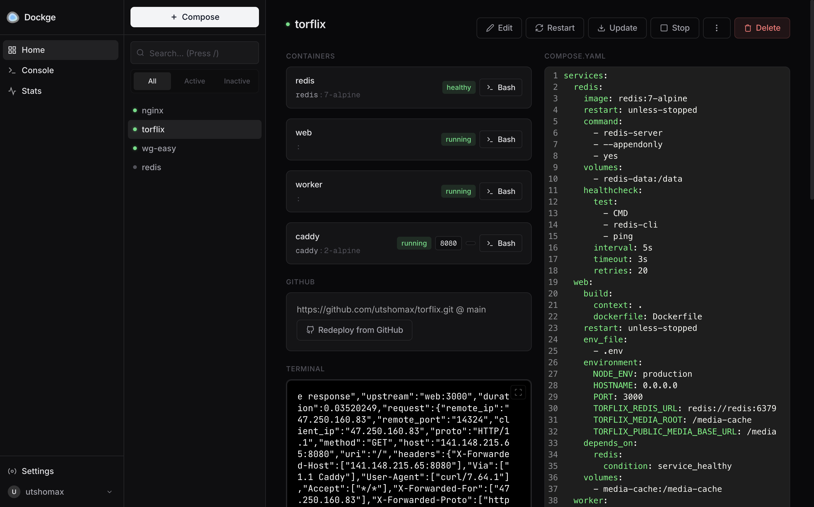
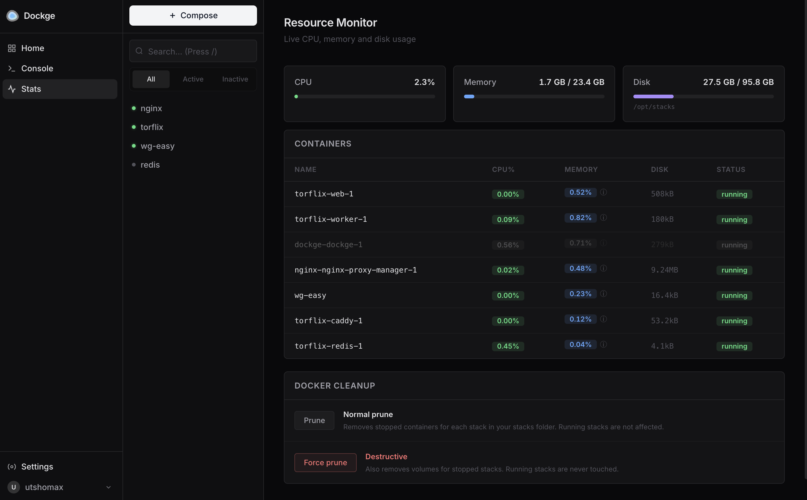

<div align="center" width="100%">
    
</div>

# Dockge

A fancy, easy-to-use and reactive self-hosted docker compose stack manager — with GitHub deploy, live resource monitoring, and Docker cleanup built in.

[](https://github.com/utshomax/dockge) [](https://github.com/utshomax/dockge/commits/master/)



## Features

- **Manage your `compose.yaml` files** — Create, Edit, Start, Stop, Restart, Delete
- **Update Docker Images** in one click
- **Interactive editor** for `compose.yaml` with syntax highlighting
- **Interactive web terminal** for each container
- **Multiple agents** — manage stacks across different Docker hosts from one interface
- **Convert `docker run ...`** commands into `compose.yaml`
- **File-based** — compose files live on your drive as normal files, no lock-in
- **Reactive** — pull/up/down progress and terminal output stream in real time

### GitHub Deploy

Link any stack to a GitHub repository and deploy directly from it. Dockge auto-detects the compose file, supports private repos via a Personal Access Token, and lets you pick the branch. A **Redeploy from GitHub** button keeps the stack in sync with your repo.

### Resource Monitor



The **Stats** page shows live host-level CPU, memory, and disk usage alongside a per-container breakdown (CPU%, memory, disk, status). Data refreshes every 5 seconds.

### Docker Cleanup

Two cleanup modes are available directly from the Stats page:

| Mode | What it does |
|---|---|
| **Prune** | Removes stopped containers for each stack in your stacks folder. Running stacks are not affected. |
| **Force prune** | Also removes volumes for stopped stacks. Running stacks are never touched. |

Both modes require an explicit confirmation step before running.

## Requirements

- [Docker](https://docs.docker.com/engine/install/) 20+ / Podman
- (Podman only) `podman-docker` — e.g. `apt install podman-docker`
- OS: major Linux distros that run Docker/Podman
  - Ubuntu, Debian (Bullseye+), Raspbian (Bullseye+), CentOS, Fedora, Arch Linux
  - Debian/Raspbian Buster or older is **not** supported
  - Windows is **not** supported
- Architecture: amd64 (x86_64), arm64, armv7

## Installation

Clone the repository and start the server with Docker Compose:

```bash
# Clone the repo
git clone https://github.com/utshomax/dockge.git
cd dockge

# Create the stacks directory
mkdir -p /opt/stacks

# Start Dockge
docker compose up -d
```

Dockge will be available at **http://localhost:5001**.

The default stacks directory is `/opt/stacks`. To change it, edit the `DOCKGE_STACKS_DIR` environment variable in `compose.yaml` before starting.

## Updating

```bash
cd dockge
git pull
docker compose up -d --build
```

## Managing existing stacks

1. Stop the stack
2. Move its compose file to `/opt/stacks/<stackName>/compose.yaml`
3. In Dockge, click **Scan Stacks Folder** from the top-right dropdown
4. The stack will appear in the list

## FAQ

**Can I manage a single container without `compose.yaml`?**
The focus of Dockge is docker compose. For single containers, use Portainer or the Docker CLI directly.

**Is this a Portainer replacement?**
If you manage everything with docker compose and want a cleaner UI, yes. If you also need to manage docker networks, single containers, or other low-level Docker primitives, Portainer may be a better fit for those tasks.

**Can I install both Dockge and Portainer?**
Yes.

**What does "Dockge" mean?**
It's a coinage word, inspired by Twitch emotes like `sadge`, `bedge`, or `wokege` — they all end in `-ge`. Intended to sound like "Dodge".

## Credits

This is a fork of [louislam/dockge](https://github.com/louislam/dockge) with additional features. If you find this useful, consider starring the original project too.
